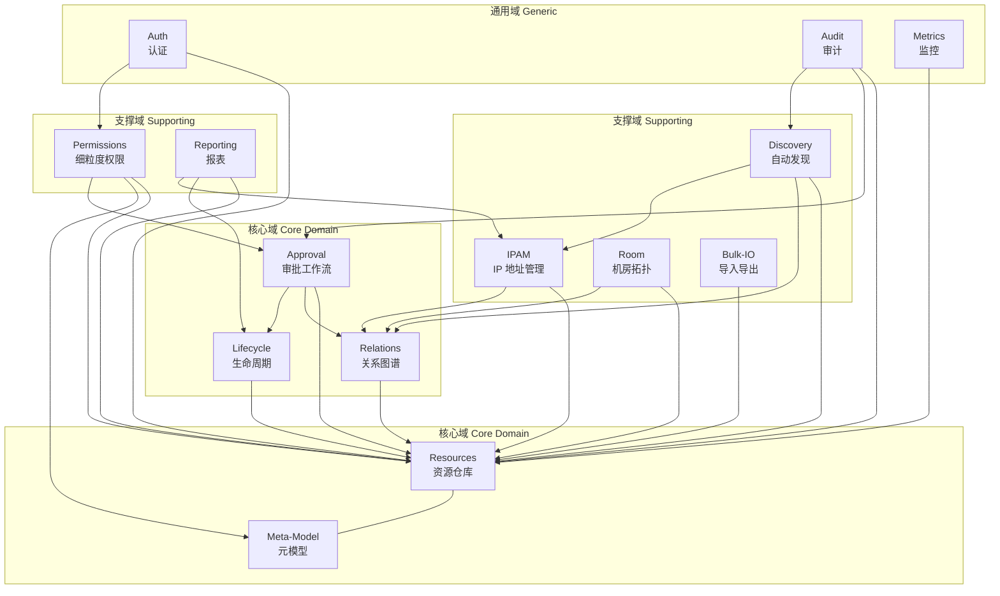

# CMDB 平台 v0.2 设计方案

> **Status**: DRAFT — 待 review
> **Author**: Coder (agent)
> **Date**: 2026-08-08
> **Scope**: 在 v0.1 基础上,补齐必修(7)+ 重要(5)= 12 个特性,高阶特性预留接口
> **Methodology**: DDD + TDD + 红绿重构

---

## 0. 文档地图

| 章节 | 主题 | 目标读者 |
|---|---|---|
| 1 | 设计原则与目标 | 全员 |
| 2 | 战略设计（DDD） | 架构师 / TL |
| 3 | 战术设计（DDD） | 后端 |
| 4 | 数据结构设计 | 后端 / DBA |
| 5 | 代码设计 | 后端 |
| 6 | 前端设计 | 前端 |
| 7 | TDD 测试策略 | 全员 |
| 8 | 实施计划（7 Sprint） | TL / PM |
| 9 | 风险与权衡 | 架构师 |
| 10 | 验收标准 | 全员 |

---

## 1. 设计原则与目标

### 1.1 设计原则

1. **领域驱动（DDD）** — 按业务能力切分限界上下文(BC),不按技术层
2. **测试驱动（TDD）** — 红绿重构,先写失败的测试再写实现
3. **小步前进** — 每个 Sprint 独立可演示、可回滚
4. **不破坏现有 API** — v0.1 已有 57 个 API 必须 100% 向后兼容
5. **防腐层（ACL）** — 跨 BC 调用走接口,不用直接查别的 BC 的 collection
6. **事件优先** — 跨 BC 用领域事件解耦,同步调用只用于查询
7. **审计全留痕** — 所有写操作进入 audit_logs（v0.1 已具备）
8. **软删除优先** — 默认不物理删除,所有资源可恢复
9. **可观测** — Prometheus 指标 + 领域事件 + 结构化日志

### 1.2 12 个新特性清单

| # | 特性 | 优先级 | 所属 BC | 工期 |
|---|---|---|---|---|
| F1 | 模型/资源**关系定义** | 🔴 必修 | relations | 3d |
| F2 | 关系**图谱查询/可视化** | 🔴 必修 | relations | 2d |
| F3 | 资源**生命周期**状态机 | 🔴 必修 | lifecycle | 2d |
| F4 | **回收站**（软删除+恢复） | 🔴 必修 | lifecycle | 1d |
| F5 | 资源**审批流** | 🔴 必修 | approval | 5d |
| F6 | **批量导入**导出 | 🔴 必修 | bulk-io | 3d |
| F7 | **自动发现 ADS** | 🔴 必修 | discovery | 7d |
| F8 | **IPAM** 子网/IP 管理 | 🟡 重要 | ipam | 3d |
| F9 | **机房拓扑** + U 位 | 🟡 重要 | room | 2d |
| F10 | 细粒度 **RBAC** | 🟡 重要 | permissions | 5d |
| F11 | **视图报表**/仪表盘 | 🟡 重要 | reporting | 2d |
| F12 | **预置模型库** | 🟡 重要 | meta-model | 1d |

**总工期**: 38 天 ≈ 7.6 周

### 1.3 不做的事（明确范围）

- ❌ 引入图数据库(Neo4j) — MongoDB 够用,后续需要再迁
- ❌ 3D 机房大屏 — 工程量大,2D 平面图 + U 位列表够用
- ❌ BPMN 工作流引擎 — 简单策略 + 多步审批就够
- ❌ 实时发现 — 全部 cron 调度
- ❌ 跨 BC 分布式事务 — 用 saga + eventual consistency
- ❌ 故障根因 / 变更影响分析 — v0.3 再做,本版预留 GraphService 接口
- ❌ Agent 远程安装 — 留 CLI 接口,本版只做 Agent 上报

---

## 2. 战略设计（DDD Strategic）

### 2.1 限界上下文划分（Bounded Contexts）



### 2.2 上下文映射（Context Map）

| 上游 BC | 下游 BC | 关系模式 | 说明 |
|---|---|---|---|
| Meta-Model | Resources | **共享内核** | meta-model.models.uid 是资源的 FK |
| Resources | Relations | **客户-供应商** | relations 消费 resources |
| Resources | Lifecycle | **共享内核** | resources.doc.lifecycle |
| Resources | Approval | **开放主机服务** | resources 暴露可审批动作 |
| Approval | Lifecycle | **领域事件** | approval.approved → lifecycle.transition |
| Approval | Relations | **领域事件** | approval.approved → relation.create |
| Discovery | Resources | **领域事件** | discovery.completed → resource.upsert |
| Discovery | Relations | **领域事件** | discovery.completed → relation.create |
| IPAM | Resources | **领域事件** | ipam.allocated → relation.create |
| Room | Resources | **领域事件** | room.placed → relation.create |
| Bulk-IO | Resources | **开放主机服务** | 走 resources 公共命令接口 |
| Permissions | (所有) | **横切关注点** | 通过 Guard / Interceptor 实现 |
| Auth | (所有) | **横切关注点** | 全局 JwtAuthGuard |
| Audit | (所有) | **横切关注点** | AuditInterceptor |
| Reporting | (所有) | **CQRS 查询端** | 只读,直连 collection(走 ACL) |

### 2.3 通用语言词汇表（Ubiquitous Language）

> 团队统一用词,代码命名、文档、UI 文案必须一致

| 术语 | 英文 | 定义 |
|---|---|---|
| 配置项 | CI (Configuration Item) | 任意可管理的资源实例(具体一台服务器、一个应用) |
| 模型 | Model (CIType) | 一类 CI 的模板,定义属性和行为 |
| 关系 | Relation | 两个 CI 之间的有向连接(如"应用 A 部署在 主机 B") |
| 关系类型 | RelationType | 关系种类的定义(如 depends_on / runs_on) |
| 生命周期状态 | LifecycleState | CI 当前所处的阶段(在库/在用/维护中/退役) |
| 审批工单 | Approval Ticket | 一个待审批的变更请求 |
| 审批策略 | Approval Policy | 触发审批的规则(什么操作、谁审批) |
| 采集任务 | Discovery Task | 自动发现的一次性或周期任务 |
| 采集运行 | Discovery Run | 一次任务执行的历史记录 |
| 子网 | Subnet | IPAM 中的 CIDR 段 |
| IP 地址 | IP Address | 具体的 IPv4/IPv6,关联到子网 |
| 机房 | Room | 数据中心物理位置 |
| 机柜 | Cabinet | 房间内的物理机柜 |
| U 位 | Rack Unit | 机柜内 1U 高度位置 |
| 资源模板 | Resource Template | 预置的模型定义(主机/MySQL/Tomcat 等) |
| 权限 | Permission | (主体, 客体, 动作) 三元组 |
| 策略评估器 | Policy Evaluator | 判断用户对资源是否有权限的领域服务 |
| 导入任务 | Import Job | 一次 Excel/CSV 导入 |
| 导出任务 | Export Job | 一次数据导出 |
| 仪表盘 | Dashboard | 多维统计的可视化展示 |

### 2.4 子域分类

| 类型 | BC | 战略意义 |
|---|---|---|
| **核心域** | relations, lifecycle, approval | 差异化能力,投入最好的人 |
| **支撑域** | discovery, ipam, room, bulk-io, permissions, reporting | 必要的支持能力,可以做得"够用"即可 |
| **通用域** | auth, audit, metrics, tags, apps, search | 已实现,继续沿用,本版重点是接入 |

---

## 3. 战术设计（DDD Tactical）

### 3.1 聚合根清单

| BC | 聚合根 | 关键实体 | 关键值对象 |
|---|---|---|---|
| **relations** | `Relation` | `RelationType`, `RelationRule` | `RelationDirection`, `Cardinality`, `RelationAttributes` |
| **lifecycle** | `ResourceLifecycle` (嵌入 Resource) | `Transition` | `LifecycleState`, `TransitionReason` |
| **approval** | `Approval` | `ApprovalPolicy`, `ApprovalStep`, `ApprovalDecision` | `ApprovalStatus`, `ApprovalType` |
| **discovery** | `DiscoveryTask` | `DiscoveryRun`, `CollectorResult` | `Protocol`, `FieldMapping`, `Credential` |
| **ipam** | `Subnet`, `IpAddress` | (内嵌) | `CIDR`, `IpStatus`, `Scope` |
| **room** | `Room`, `Cabinet` | `RackUnit` | `Position`, `UnitStatus` |
| **permissions** | `Permission` | `Role`, `User` (复用 auth) | `Action`, `ResourceType`, `Condition` |
| **bulk-io** | `ImportJob`, `ExportJob` | `RowError`, `RowResult` | `FileFormat`, `ImportMode` |
| **reporting** | (无聚合根,纯查询) | - | `Snapshot` |

### 3.2 关键值对象定义

```ts
// packages/shared/src/types/lifecycle.ts
export enum LifecycleState {
  IN_STOCK = 'in_stock',         // 入库未分配
  IN_USE = 'in_use',              // 正在使用
  MAINTAINING = 'maintaining',   // 维护中
  CHANGING = 'changing',          // 变更中
  RETIRED = 'retired',            // 退役
  DELETED = 'deleted',            // 软删除（回收站）
}

export const LifecycleStateTransitions: Record<LifecycleState, LifecycleState[]> = {
  in_stock:     ['in_use', 'deleted'],
  in_use:       ['maintaining', 'changing', 'retired', 'deleted'],
  maintaining:  ['in_use', 'retired', 'deleted'],
  changing:     ['in_use', 'retired', 'deleted'],
  retired:      ['in_stock', 'deleted'],  // 退役后可以重新启用
  deleted:      [],                        // 软删除只能 restore
};

export enum RelationTypeCode {
  DEPENDS_ON = 'depends_on',           // 依赖于
  RUNS_ON = 'runs_on',                 // 运行在
  DEPLOYED_IN = 'deployed_in',         // 部署于
  CONNECTS_TO = 'connects_to',         // 连接到
  CONTAINS = 'contains',               // 包含
  MOUNTED_ON = 'mounted_on',           // 挂载于
  REPLICA_OF = 'replica_of',           // 是...的副本
  OWNS = 'owns',                       // 拥有
  USES = 'uses',                       // 使用
  BELONGS_TO = 'belongs_to',           // 属于
}

export enum Action {
  READ = 'read',
  CREATE = 'create',
  UPDATE = 'update',
  DELETE = 'delete',
  APPROVE = 'approve',
  TRANSITION = 'transition',
}

export enum ApprovalType {
  CREATE_RESOURCE = 'create_resource',
  UPDATE_RESOURCE = 'update_resource',
  DELETE_RESOURCE = 'delete_resource',
  CHANGE_STATE = 'change_state',
  ADD_RELATION = 'add_relation',
  REMOVE_RELATION = 'remove_relation',
  BULK_IMPORT = 'bulk_import',
  IP_ALLOCATE = 'ip_allocate',
}
```

### 3.3 领域事件清单

| 事件名 | 触发时机 | Payload | 订阅方 |
|---|---|---|---|
| `ResourceCreated` | 资源创建成功 | resourceId, modelUid, data | audit, metrics, relations(图谱重建) |
| `ResourceUpdated` | 资源更新 | resourceId, diff, before, after | audit, metrics |
| `ResourceStateChanged` | 状态机变更 | resourceId, fromState, toState, reason | audit, metrics, reporting |
| `ResourceSoftDeleted` | 进入回收站 | resourceId, deletedBy, deletedAt | audit, metrics, relations(级联失效) |
| `ResourceRestored` | 从回收站恢复 | resourceId, restoredBy | audit, metrics, relations(恢复) |
| `RelationCreated` | 关系创建 | relationId, sourceId, targetId, type | reporting, permissions(缓存) |
| `RelationDeleted` | 关系删除 | relationId | reporting |
| `ApprovalRequested` | 工单创建 | approvalId, type, requester, payload | audit, notification(预留) |
| `ApprovalDecided` | 审批通过/拒绝 | approvalId, decision, approver, comment | audit, notification |
| `ApprovalApplied` | 审批结果被执行 | approvalId, appliedChanges | audit, metrics |
| `DiscoveryTaskStarted` | 任务开始 | taskId, runId | metrics, audit |
| `DiscoveryTaskCompleted` | 任务完成 | taskId, runId, stats | reporting, notification |
| `DiscoveryConflictDetected` | 数据冲突 | taskId, resourceId, conflicting | reporting |
| `SubnetCreated` | 子网创建 | subnetId, cidr | reporting |
| `IpAllocated` | IP 分配 | ipId, resourceId, allocatedBy | relations(创建 IP→资源关系) |
| `IpReleased` | IP 释放 | ipId | relations(删除关系) |
| `IpConflictDetected` | 检测到冲突 | subnetId, ip, conflicting | reporting, notification |
| `RoomPlaced` | 资源放入机柜 | resourceId, cabinetId, unitRange | relations(创建关系) |

**事件总线**: 复用 `@nestjs/event-emitter`(v0.1 已部分使用),无需引入新依赖。

### 3.4 关键领域服务

#### 3.4.1 GraphService（关系 BC 核心）

```ts
// apps/server/src/modules/relations/domain/graph.service.ts
export interface GraphNode {
  id: string;
  type: 'resource' | 'app' | 'subnet' | 'cabinet';
  label: string;
  meta?: Record<string, any>;
  edges: GraphEdge[];
}

export interface GraphEdge {
  id: string;
  type: string;
  direction: 'out' | 'in';
  targetId: string;
  attributes?: Record<string, any>;
}

export interface GraphPath {
  nodes: GraphNode[];
  edges: GraphEdge[];
  totalLength: number;
}

class GraphService {
  // 从 root 出发深度遍历（用于拓扑图）
  async traverse(
    rootId: string,
    options: { direction: 'up' | 'down' | 'both'; maxDepth: number; relationTypes?: string[] }
  ): Promise<GraphNode>;

  // 找两点之间最短路径
  async findPath(fromId: string, toId: string, maxDepth: number): Promise<GraphPath | null>;

  // 影响分析：找出 root 下游 N 层所有节点（变更前用）
  async impactAnalysis(rootId: string, relationType: string, maxDepth: number): Promise<string[]>;

  // 检测环
  async detectCycle(sourceId: string, targetId: string): Promise<boolean>;
}
```

#### 3.4.2 LifecycleService

```ts
// apps/server/src/modules/lifecycle/domain/lifecycle.service.ts
class LifecycleService {
  // 检查状态变更是否合法
  canTransition(from: LifecycleState, to: LifecycleState): boolean;

  // 执状态变更（持久化 + 发出事件）
  async transition(resourceId: string, to: LifecycleState, reason: string, actor: User): Promise<void>;

  // 软删除
  async softDelete(resourceId: string, actor: User): Promise<void>;

  // 恢复
  async restore(resourceId: string, actor: User): Promise<void>;

  // 列出回收站（带过滤）
  async listTrash(filter: TrashFilter, pagination: Pagination): Promise<Resource[]>;

  // 物理删除（仅 admin,且必须是 deleted 状态超过 30 天）
  async purge(resourceId: string, actor: User): Promise<void>;
}
```

#### 3.4.3 ApprovalEngine

```ts
// apps/server/src/modules/approval/domain/approval.engine.ts
class ApprovalEngine {
  // 判断操作是否需要审批
  async requiresApproval(action: Action, target: any, actor: User): Promise<boolean>;

  // 创建工单
  async createTicket(
    action: Action,
    target: { type: string; id: string },
    payload: any,
    requester: User
  ): Promise<Approval>;

  // 审批决定
  async decide(
    approvalId: string,
    decision: 'approve' | 'reject',
    comment: string,
    actor: User
  ): Promise<Approval>;

  // 应用工单（执行被批准的操作）
  async apply(approvalId: string): Promise<void>;
}
```

#### 3.4.4 PolicyEvaluator（权限 BC 核心）

```ts
// apps/server/src/modules/permissions/domain/policy-evaluator.ts
class PolicyEvaluator {
  // 单点检查
  can(user: User, action: Action, resource: Resource | { type: string; id: string }): boolean;

  // 批量过滤
  filter<T extends Resource>(user: User, action: Action, resources: T[]): T[];

  // 行级条件评估
  private evaluateConditions(conditions: Condition[], user: User, resource: any): boolean;
}
```

---

## 4. 数据结构设计

### 4.1 总体策略

| 项 | 决策 |
|---|---|
| 关系存储 | **独立边表 collection**(`relations`),不嵌套在资源 doc |
| 关系类型 | **独立 collection**(`relation_types`),支持系统预置 + 用户自定义 |
| 软删除 | 在资源 doc 加 `lifecycle.state = 'deleted'` + `deletedAt` 字段 |
| 回收站 | 同上,通过 `state = 'deleted'` 过滤 |
| ID 策略 | 业务 ID 用 `nanoid`(12 字符),MongoDB 主键仍是 ObjectId |
| 时间戳 | 全部 `Date` 类型,UTC 存储,前端按本地时区展示 |
| 加密字段 | `discovery_tasks.credentials.password` / `privateKey`,用 v0.1 的 `crypto.util.ts` |

### 4.2 新增集合 Schema

#### 4.2.1 `relation_types`（关系类型定义）

```ts
{
  _id: ObjectId,
  code: string,                  // 唯一 'depends_on'
  name: string,                  // '依赖于'
  inverseCode: string,           // 'depended_by'
  description?: string,
  cardinality: '1:1' | '1:N' | 'N:1' | 'N:M',
  sourceTypeConstraint?: 'resource' | 'app' | 'business' | 'subnet' | 'cabinet' | 'any',
  targetTypeConstraint?: 'resource' | 'app' | 'business' | 'subnet' | 'cabinet' | 'any',
  sourceModelConstraint?: string,  // 可选: 限定 source 必须是某 modelUid
  targetModelConstraint?: string,
  bidirectional: boolean,
  isSystem: boolean,             // 系统预置不可删
  icon?: string,                 // 前端显示用
  color?: string,                // 关系线颜色
  createdAt: Date,
  updatedAt: Date,
}
// 索引
{ code: 1 } unique
```

**预置 10 种系统关系**（isSystem=true, 启动 seed）:
- `depends_on` / `depended_by` (1:N)
- `runs_on` / `hosted_by` (N:1)
- `deployed_in` / `deployment_of` (N:1)
- `connects_to` / `connected_from` (N:M)
- `contains` / `contained_in` (1:N)
- `mounted_on` / `mounts` (N:1)
- `replica_of` / `replicated_by` (N:M)
- `owns` / `owned_by` (1:N)
- `uses` / `used_by` (N:M)
- `belongs_to` / `has_member` (N:1)

#### 4.2.2 `relations`（关系实例/边表）

```ts
{
  _id: ObjectId,
  sourceId: string,             // 业务 ID,跨 BC 通用
  sourceType: 'resource' | 'app' | 'business' | 'subnet' | 'cabinet',
  targetId: string,
  targetType: 'resource' | 'app' | 'business' | 'subnet' | 'cabinet',
  relationType: string,         // relation_types.code
  inverseRelationType?: string, // 冗余,便于查询
  attributes?: {                // 边属性(端口、协议、状态等)
    [key: string]: any
  },
  isAutoDiscovered: boolean,
  status: 'active' | 'pending' | 'archived',
  createdBy: string,
  createdAt: Date,
  updatedAt: Date,
}
// 索引
{ sourceType: 1, sourceId: 1, relationType: 1, status: 1 }
{ targetType: 1, targetId: 1, relationType: 1, status: 1 }
{ sourceType: 1, sourceId: 1, status: 1 }
{ targetType: 1, targetId: 1, status: 1 }
{ relationType: 1, status: 1 }
{ createdAt: -1 }
```

#### 4.2.3 资源 doc 扩展字段（不新建 collection）

```ts
// 在 m_<uid> 集合的 schema 统一加这几个字段（dynamic-schema.factory.ts）
{
  // ...原有字段...
  lifecycle: {
    state: LifecycleState,         // 默认 'in_stock'
    previousState?: LifecycleState,
    enteredAt: Date,
    enteredBy: string,
    history: [{
      from: LifecycleState,
      to: LifecycleState,
      reason: string,
      actor: string,
      at: Date,
    }]                              // 仅保留最近 20 条
  },
  // 软删除字段（v0.1 没有）
  deletedAt?: Date,
  deletedBy?: string,
  // 审计字段（v0.1 已有,统一）
  createdBy: string,
  updatedBy?: string,
  // 审批相关
  pendingApprovalId?: string,       // 当前挂起的工单
}
// 索引
{ 'lifecycle.state': 1, deletedAt: 1 }
{ deletedAt: -1 }                   // 回收站查询
```

#### 4.2.4 `approvals`（审批工单）

```ts
{
  _id: ObjectId,
  ticketNo: string,               // 'AP-20260808-00001' 自增
  type: ApprovalType,
  targetType: string,             // 'resource' | 'relation' | 'subnet' | ...
  targetId: string,
  payload: any,                   // 申请执行的操作内容
  diff?: any,                     // 与当前状态的 diff（JSON）
  requesterId: string,
  requesterName: string,
  policyId: ObjectId,             // 命中的策略
  currentStep: number,            // 0-based
  totalSteps: number,
  status: 'pending' | 'approved' | 'rejected' | 'cancelled' | 'expired' | 'applied',
  decisions: [{
    stepIndex: number,
    approverId: string,
    approverName: string,
    decision: 'approve' | 'reject',
    comment: string,
    decidedAt: Date,
  }],
  expiresAt: Date,                // 7 天后自动 expired
  appliedAt?: Date,
  result?: { success: boolean, error?: string },
  createdAt: Date,
  updatedAt: Date,
}
// 索引
{ status: 1, createdAt: -1 }
{ requesterId: 1, status: 1, createdAt: -1 }
{ targetType: 1, targetId: 1 }
{ ticketNo: 1 } unique
{ expiresAt: 1 }                  // 定时清理
```

#### 4.2.5 `approval_policies`（审批策略）

```ts
{
  _id: ObjectId,
  name: string,                   // '生产环境资源删除'
  description?: string,
  appliesTo: {
    type: 'resource' | 'relation' | 'subnet',
    modelUid?: string,            // resource 类时限定模型
  },
  trigger: ApprovalType,          // 触发的动作
  conditions: [{                  // 行级条件（AND 关系）
    field: string,                // 'lifecycle.state' 或自定义字段
    op: 'eq' | 'ne' | 'in' | 'gt' | 'lt' | 'contains',
    value: any,
  }],
  steps: [{                       // 多步审批,按顺序
    name: string,                 // '直属主管'
    approverType: 'role' | 'user' | 'field_owner',
    approverValue: string,        // role: 'admin'; user: 'userId'; field: 'fieldName'
    timeoutHours: number,         // 24,48,72
  }],
  enabled: boolean,
  priority: number,               // 数字大优先
  createdAt: Date,
  updatedAt: Date,
}
// 索引
{ 'appliesTo.type': 1, enabled: 1, priority: -1 }
```

**预置 3 个系统策略**:
1. `资源删除需 admin 审批`
2. `生产环境资源变更需 owner + admin 审批`
3. `资源审批豁免: admin 可直接操作`

#### 4.2.6 `discovery_tasks`（自动发现任务）

```ts
{
  _id: ObjectId,
  name: string,
  protocol: 'ssh' | 'snmp' | 'ipmi' | 'http' | 'agent' | 'mock',
  target: {
    type: 'ip_range' | 'host_list' | 'subnet' | 'agent_id',
    ipRange?: { start: string; end: string },
    hostList?: string[],
    subnetId?: string,
    agentIds?: string[],
  },
  credentials: {                  // 加密存储
    username?: string,
    password?: string,            // 加密
    privateKey?: string,          // 加密
    port?: number,
    snmpCommunity?: string,
    snmpVersion?: 'v1' | 'v2c' | 'v3',
  },
  schedule: {
    enabled: boolean,
    cron?: string,                // '0 2 * * *'
    onDemand: boolean,            // 允许手动触发
  },
  modelUid: string,               // 采集数据写入哪个模型
  fieldMapping: {                 // 'output.cpu_cores' -> 'Cpu'
    [key: string]: string
  },
  filters?: {                     // 跳过规则
    excludeIpPatterns?: string[],
    requireMinMemoryMB?: number,
  },
  conflictPolicy: 'overwrite' | 'merge' | 'skip' | 'report',
  status: 'idle' | 'running' | 'success' | 'failed' | 'partial' | 'disabled',
  lastRunAt?: Date,
  lastRunStats?: {
    totalHosts: number,
    successHosts: number,
    failedHosts: number,
    newResources: number,
    updatedResources: number,
    conflicts: number,
  },
  requireApproval: boolean,       // 自动发现是否需要审批(v0.2 默认 false)
  enabled: boolean,
  createdBy: string,
  createdAt: Date,
  updatedAt: Date,
}
// 索引
{ enabled: 1, status: 1 }
{ protocol: 1, enabled: 1 }
```

#### 4.2.7 `discovery_runs`（任务执行历史）

```ts
{
  _id: ObjectId,
  taskId: ObjectId,
  taskName: string,
  trigger: 'scheduled' | 'manual' | 'api',
  startedAt: Date,
  finishedAt?: Date,
  status: 'running' | 'success' | 'failed' | 'partial' | 'cancelled',
  progress: {
    total: number,                // 总目标数
    processed: number,            // 已处理
    succeeded: number,
    failed: number,
  },
  logs: [{                        // 详细日志,仅保留失败/重要的
    host: string,
    level: 'info' | 'warn' | 'error',
    message: string,
    timestamp: Date,
  }],
  result: {
    newResources: ObjectId[],     // 新增的资源 ID
    updatedResources: ObjectId[], // 更新的资源 ID
    conflicts: [{                  // 冲突记录
      resourceId: string,
      field: string,
      existing: any,
      discovered: any,
    }],
  },
  error?: string,
  durationMs?: number,
  createdAt: Date,
}
// 索引
{ taskId: 1, startedAt: -1 }
{ status: 1, startedAt: -1 }
// TTL: 90 天后自动删除（仅 logs/result,保留 stats）
{ createdAt: 1 } expireAfterSeconds: 7776000
```

#### 4.2.8 `ipam_subnets`（子网）

```ts
{
  _id: ObjectId,
  cidr: string,                   // '10.0.0.0/24' 唯一
  name: string,
  parentId?: ObjectId,            // 层级(支持子网嵌套)
  vlanId?: number,
  gateway?: string,
  dns?: string[],
  dhcpRange?: { start: string; end: string },
  scope: string,                  // 'beijing-dc1' | 'shanghai-dc1'
  environment: 'production' | 'staging' | 'dev' | 'test' | 'office',
  totalAddresses: number,         // 2^(32-prefix)-2
  allocatedAddresses: number,     // 实时计算,允许略微延迟
  reservedAddresses: number,
  tags: string[],
  notes?: string,
  createdBy: string,
  createdAt: Date,
  updatedAt: Date,
}
// 索引
{ cidr: 1 } unique
{ parentId: 1 }
{ scope: 1, environment: 1 }
```

#### 4.2.9 `ipam_addresses`（IP 地址）

```ts
{
  _id: ObjectId,
  subnetId: ObjectId,
  ip: string,                     // '10.0.0.5'
  status: 'available' | 'allocated' | 'reserved' | 'expired' | 'conflict',
  resourceId?: string,            // 关联资源
  reservedBy?: string,
  reservedUntil?: Date,
  notes?: string,
  lastSeenAt?: Date,              // 自动发现发现它的时间
  allocatedAt?: Date,
  allocatedBy?: string,
  history: [{                     // 最多 10 条
    action: 'allocate' | 'release' | 'reserve' | 'conflict' | 'discover',
    by: string,
    at: Date,
    details?: string,
  }],
  createdAt: Date,
  updatedAt: Date,
}
// 索引
{ subnetId: 1, ip: 1 } unique
{ status: 1, subnetId: 1 }
{ resourceId: 1 }
{ ip: 1 }
```

#### 4.2.10 `rooms`（机房）

```ts
{
  _id: ObjectId,
  code: string,                   // 'DC-BJ-01' 唯一
  name: string,
  address?: string,
  totalPowerKVA?: number,
  environment: {                  // 环境监控
    temperature?: { current: number; min: number; max: number; sensorId?: string },
    humidity?: { current: number; min: number; max: number; sensorId?: string },
  },
  totalCabinets: number,
  totalU: number,
  usedU: number,
  totalPowerW: number,
  usedPowerW: number,
  layoutImageUrl?: string,        // 机房平面图(可选)
  createdAt: Date,
  updatedAt: Date,
}
// 索引
{ code: 1 } unique
```

#### 4.2.11 `cabinets`（机柜）

```ts
{
  _id: ObjectId,
  roomId: ObjectId,
  code: string,                   // 'A01'
  name?: string,
  totalU: number,                 // 42 / 48
  maxPowerW: number,
  usedU: number,                  // 实时
  usedPowerW: number,
  position: {
    row: number,
    col: number,
    x?: number, y?: number,       // 像素坐标(用于平面图)
  },
  status: 'active' | 'maintenance' | 'decommissioned',
  createdAt: Date,
  updatedAt: Date,
}
// 索引
{ roomId: 1, code: 1 } unique
{ roomId: 1, position: 1 }
```

#### 4.2.12 `rack_units`（U 位）

```ts
{
  _id: ObjectId,
  cabinetId: ObjectId,
  startU: number,                 // 起始 U 位(1-42)
  heightU: number,                // 占用 U 数(1U/2U/4U)
  endU: number,                   // startU + heightU - 1
  status: 'empty' | 'occupied' | 'reserved' | 'disabled',
  resourceId?: string,            // 占用此 U 位的资源
  reservedBy?: string,
  reservedUntil?: Date,
  installedAt?: Date,
  notes?: string,
  createdAt: Date,
  updatedAt: Date,
}
// 索引
{ cabinetId: 1, startU: 1, endU: 1 } unique
{ resourceId: 1 }
{ status: 1, cabinetId: 1 }
```

#### 4.2.13 `permissions`（细粒度权限）

```ts
{
  _id: ObjectId,
  subjectType: 'role' | 'user',
  subjectId: string,              // role: 'admin'/'operator'/'viewer'; user: userId
  objectType: 'model' | 'resource' | 'menu' | 'route',
  objectId?: string,              // null = 整个类型;具体值 = 单个
  actions: Action[],              // ['read', 'update']
  conditions?: {                  // 行级条件(简化版)
    field: string,
    op: 'eq' | 'in' | 'ne' | 'contains',
    value: any,
  }[],
  effect: 'allow' | 'deny',       // 默认 allow
  priority: number,               // deny 优先于 allow
  grantedBy: string,
  expiresAt?: Date,
  createdAt: Date,
  updatedAt: Date,
}
// 索引
{ subjectType: 1, subjectId: 1, objectType: 1, objectId: 1 }
{ expiresAt: 1 }                 // 定时清理
```

**行级条件示例**:
- `environment = 'production'`: 只能看生产环境
- `createdBy = ${userId}`: 只能看自己创建的
- `tags CONTAINS 'team:infra'`: 只能看自己团队标签的

#### 4.2.14 `import_jobs` / `export_jobs`

```ts
// import_jobs
{
  _id: ObjectId,
  modelUid: string,
  fileName: string,
  fileSize: number,
  fileKey: string,                // OSS/local path
  uploadedBy: string,
  mode: 'create_only' | 'upsert' | 'update_only',  // 创建/更新/upsert
  dryRun: boolean,                // 试运行,只校验不入库
  fieldMapping?: { [csvCol: string]: string },  // 列名映射
  status: 'pending' | 'processing' | 'completed' | 'failed' | 'partial' | 'cancelled',
  progress: { total: number; processed: number; success: number; failed: number },
  errors: [{ row: number; field: string; message: string; value?: any }],
  startedAt?: Date,
  finishedAt?: Date,
  durationMs?: number,
  createdAt: Date,
}

// export_jobs
{
  _id: ObjectId,
  modelUid: string,
  filters?: any,
  format: 'xlsx' | 'csv' | 'json',
  fields: string[],
  status: 'pending' | 'processing' | 'completed' | 'failed',
  fileKey?: string,               // 完成后存这里
  fileUrl?: string,               // 下载 URL(签名,24h 过期)
  totalRows?: number,
  startedAt?: Date,
  finishedAt?: Date,
  createdBy: string,
  createdAt: Date,
}
// 索引
{ status: 1, createdAt: -1 }
{ modelUid: 1, createdAt: -1 }
```

#### 4.2.15 `model_templates`（预置模型库, v0.2.12）

```ts
{
  _id: ObjectId,
  code: string,                   // 'linux-server' 唯一
  name: string,                   // 'Linux 服务器'
  category: 'compute' | 'network' | 'storage' | 'database' | 'middleware' | 'application' | 'service',
  icon?: string,
  fields: [{                      // 完整的字段定义,可直接导入
    code: string,
    name: string,
    type: 'string' | 'number' | 'boolean' | 'date' | 'enum' | 'json',
    required: boolean,
    unique?: boolean,
    defaultValue?: any,
    enumValues?: string[],
    validators?: { min?: number; max?: number; pattern?: string },
    groupName?: string,
  }],
  relations?: [{                  // 推荐关系
    type: string,
    targetTemplateCode: string,
  }],
  isSystem: boolean,
  createdAt: Date,
  updatedAt: Date,
}
```

**预置 10 个模型模板**:
- `linux-server`, `windows-server`, `vmware-vm`, `docker-container`
- `mysql`, `postgresql`, `redis`, `mongodb`, `kafka`, `tomcat`, `nginx`
- `network-switch`, `network-router`, `firewall`
- `application`（业务应用）
- 后续 Sprint 5 完成后加 `k8s-pod`, `k8s-service`

### 4.3 现有 schema 改动

| Collection | 字段 | 操作 |
|---|---|---|
| 资源(`m_<uid>`) | `lifecycle.state` 等 | 新增（dynamic-schema.factory.ts 注入） |
| 资源 | `deletedAt`, `deletedBy` | 新增 |
| 资源 | `pendingApprovalId` | 新增 |
| `meta-model.models` | `enableApproval` | 新增 |
| `meta-model.models` | `defaultLifecycle` | 新增 |
| `apps` | `lifecycle` | 新增 |
| `users` | `roles[]` | 已是数组,无改 |

### 4.4 索引策略总览

```ts
// 在每个 module 的 onModuleInit 里创建索引
// 统一用 ensureIndexes() 幂等操作
```

### 4.5 数据迁移

| 步骤 | 动作 | 回滚 |
|---|---|---|
| M1: 加字段 | `db.meta-model.models.updateMany({}, {$set: {enableApproval: false, defaultLifecycle: 'in_stock'}})` | 不需要回滚,字段默认值 |
| M2: 资源 doc 加 lifecycle | 懒加载: 读取时检查,无则补默认 | 同上 |
| M3: seed 关系类型 + 审批策略 + 模型模板 | 启动时检查,缺失则插入 | 删 isSystem=false 的 |
| M4: 软删除补默认值 | `db.m_*.updateMany({deletedAt: {$exists: false}}, {$set: {deletedAt: null}})` | 不需要回滚 |

迁移全部 **idempotent**,可重复执行。

---

## 5. 代码设计

### 5.1 模块结构（每个 BC 统一分层）

```
modules/<bc>/
├── domain/                       # 领域层(纯业务,无框架依赖)
│   ├── <bc>.aggregate.ts        # 聚合根
│   ├── <entity>.entity.ts       # 实体
│   ├── <vo>.vo.ts               # 值对象
│   ├── <bc>.service.ts          # 领域服务(无 IO)
│   └── <bc>.events.ts           # 领域事件
├── application/                  # 应用层(用例编排)
│   ├── <bc>.service.ts          # 应用服务(可注入仓储、事件总线)
│   └── <bc>.controller.ts       # HTTP 接口
├── infra/                        # 基础设施层(Mongoose/Redis)
│   ├── <bc>.schema.ts           # Mongoose Schema
│   ├── <bc>.repository.ts       # 仓储实现
│   └── <bc>.mapper.ts           # schema ↔ domain 映射
├── <bc>.module.ts
└── __tests__/                    # 同级测试
    ├── unit/
    │   └── <bc>.service.spec.ts
    ├── integration/
    │   └── <bc>.controller.spec.ts
    └── e2e/
        └── <bc>.e2e-spec.ts
```

**关键原则**:
- `domain/` 不依赖 `@nestjs/*` 任何东西,可纯单元测试
- `application/` 编排用例,可注入多个仓储和事件总线
- `infra/` 只做持久化和外部 IO
- 跨 BC 只能调用 `application` 层暴露的接口,不能直接进别的 BC 的 collection

### 5.2 9 个新 BC 的目录骨架

```
apps/server/src/modules/
├── relations/                 # F1 + F2
├── lifecycle/                 # F3 + F4
├── approval/                  # F5
├── bulk-io/                   # F6
├── discovery/                 # F7
├── ipam/                      # F8
├── room/                      # F9
├── permissions/               # F10
├── reporting/                 # F11
└── model-templates/           # F12（轻量,挂 meta-model 下）
```

### 5.3 关键代码契约（TypeScript 签名）

#### 5.3.1 Resources BC 扩展（接入 lifecycle/approval/permissions）

```ts
// apps/server/src/modules/resources/resources.service.ts 扩展

class ResourcesService {
  // 创建资源：走 lifecycle + approval 拦截
  async create(modelUid: string, data: any, actor: User): Promise<Resource>;
  // 读取：走 permissions.filter()
  async findById(id: string, actor: User): Promise<Resource>;
  // 更新：走 approval 拦截
  async update(id: string, patch: any, actor: User): Promise<Resource>;
  // 删除：走 softDelete + approval
  async delete(id: string, actor: User): Promise<void>;
  // 状态变更：走 lifecycle
  async transition(id: string, to: LifecycleState, reason: string, actor: User): Promise<void>;
}
```

#### 5.3.2 Relations API

```ts
@Controller('api/relations')
class RelationsController {
  // CRUD
  @Get() findAll(@Query() q: RelationFilter): Promise<Relation[]>;
  @Post() create(@Body() dto: CreateRelationDto, @CurrentUser() u: User): Promise<Relation>;
  @Delete(':id') remove(@Param('id') id: string, @CurrentUser() u: User): Promise<void>;
  @Put(':id') update(@Param('id') id: string, @Body() dto: UpdateRelationDto): Promise<Relation>;

  // 图谱
  @Get('graph') traverse(@Query() q: GraphQuery): Promise<GraphNode>;
  @Get('path') findPath(@Query() q: PathQuery): Promise<GraphPath | null>;
  @Get('impact') impactAnalysis(@Query() q: ImpactQuery): Promise<string[]>;
  @Get('cycle') detectCycle(@Query() q: CycleQuery): Promise<{ hasCycle: boolean }>;

  // 关系类型
  @Get('types') listTypes(): Promise<RelationType[]>;
  @Post('types') createType(@Body() dto: CreateRelationTypeDto): Promise<RelationType>;
}
```

#### 5.3.3 Approval API

```ts
@Controller('api/approvals')
class ApprovalsController {
  @Get() list(@Query() q: ApprovalFilter): Promise<Approval[]>;
  @Get('mine/pending') listMyPending(@CurrentUser() u: User): Promise<Approval[]>;
  @Get(':id') get(@Param('id') id: string): Promise<Approval>;
  @Post() create(@Body() dto: CreateApprovalDto, @CurrentUser() u: User): Promise<Approval>;
  @Post(':id/approve') approve(@Param('id') id: string, @Body() dto: DecideDto, @CurrentUser() u: User): Promise<Approval>;
  @Post(':id/reject') reject(@Param('id') id: string, @Body() dto: DecideDto, @CurrentUser() u: User): Promise<Approval>;
  @Post(':id/cancel') cancel(@Param('id') id: string, @CurrentUser() u: User): Promise<Approval>;
}

@Controller('api/approval-policies')
class ApprovalPoliciesController {
  @Get() list(): Promise<ApprovalPolicy[]>;
  @Post() create(@Body() dto: CreatePolicyDto): Promise<ApprovalPolicy>;
  @Put(':id') update(@Param('id') id: string, @Body() dto: UpdatePolicyDto): Promise<ApprovalPolicy>;
  @Delete(':id') remove(@Param('id') id: string): Promise<void>;
  @Post(':id/test') test(@Param('id') id: string, @Body() sample: any): Promise<{ match: boolean }>;
}
```

#### 5.3.4 Discovery API

```ts
@Controller('api/discovery')
class DiscoveryController {
  @Get('tasks') listTasks(@Query() q: TaskFilter): Promise<DiscoveryTask[]>;
  @Post('tasks') createTask(@Body() dto: CreateTaskDto, @CurrentUser() u: User): Promise<DiscoveryTask>;
  @Put('tasks/:id') updateTask(@Param('id') id: string, @Body() dto: UpdateTaskDto): Promise<DiscoveryTask>;
  @Delete('tasks/:id') removeTask(@Param('id') id: string): Promise<void>;
  @Post('tasks/:id/run') runTask(@Param('id') id: string, @CurrentUser() u: User): Promise<DiscoveryRun>;
  @Post('tasks/:id/enable') enableTask(@Param('id') id: string): Promise<DiscoveryTask>;
  @Post('tasks/:id/disable') disableTask(@Param('id') id: string): Promise<DiscoveryTask>;

  @Get('tasks/:id/runs') listRuns(@Param('id') id: string, @Query() q: RunFilter): Promise<DiscoveryRun[]>;
  @Get('runs/:id') getRun(@Param('id') id: string): Promise<DiscoveryRun>;
}
```

#### 5.3.5 IPAM API

```ts
@Controller('api/ipam')
class IpamController {
  // 子网
  @Get('subnets') listSubnets(@Query() q: SubnetFilter): Promise<Subnet[]>;
  @Post('subnets') createSubnet(@Body() dto: CreateSubnetDto, @CurrentUser() u: User): Promise<Subnet>;
  @Get('subnets/:id') getSubnet(@Param('id') id: string): Promise<Subnet>;
  @Put('subnets/:id') updateSubnet(@Param('id') id: string, @Body() dto: UpdateSubnetDto): Promise<Subnet>;
  @Delete('subnets/:id') removeSubnet(@Param('id') id: string): Promise<void>;
  @Get('subnets/:id/usage') getSubnetUsage(@Param('id') id: string): Promise<SubnetUsage>;
  @Get('subnets/:id/addresses') listAddresses(@Param('id') id: string, @Query() q: AddressFilter): Promise<IpAddress[]>;

  // IP
  @Post('allocate') allocate(@Body() dto: AllocateIpDto, @CurrentUser() u: User): Promise<IpAddress>;
  @Post('release') release(@Body() dto: ReleaseIpDto, @CurrentUser() u: User): Promise<IpAddress>;
  @Post('reserve') reserve(@Body() dto: ReserveIpDto, @CurrentUser() u: User): Promise<IpAddress>;
  @Get('conflicts') listConflicts(@Query() q: ConflictFilter): Promise<IpAddress[]>;
  @Post('scan') scanSubnet(@Body() dto: { subnetId: string }): Promise<{ scanned: number; conflicts: number }>;
}
```

#### 5.3.6 Permissions API

```ts
@Controller('api/permissions')
class PermissionsController {
  @Get() list(@Query() q: PermissionFilter): Promise<Permission[]>;
  @Post() grant(@Body() dto: GrantPermissionDto, @CurrentUser() u: User): Promise<Permission>;
  @Put(':id') update(@Param('id') id: string, @Body() dto: UpdatePermissionDto): Promise<Permission>;
  @Delete(':id') revoke(@Param('id') id: string): Promise<void>;
  // 内部 API: Guard/Interceptor 调用
  @Post('check') check(@Body() dto: CheckPermissionDto, @CurrentUser() u: User): Promise<{ allowed: boolean }>;
}
```

#### 5.3.7 Bulk I/O API

```ts
@Controller('api/bulk-io')
class BulkIoController {
  @Post('import') upload(@UploadedFile() file: Express.Multer.File, @Body() dto: ImportOptionsDto, @CurrentUser() u: User): Promise<ImportJob>;
  @Get('import/:id') getImport(@Param('id') id: string): Promise<ImportJob>;
  @Get('import') listImports(@Query() q: ImportFilter): Promise<ImportJob[]>;
  @Post('import/:id/cancel') cancelImport(@Param('id') id: string): Promise<ImportJob>;

  @Get('template/:modelUid') downloadTemplate(@Param('modelUid') uid: string, @Res() res: Response): Promise<void>;
  @Post('export') createExport(@Body() dto: CreateExportDto, @CurrentUser() u: User): Promise<ExportJob>;
  @Get('export/:id') getExport(@Param('id') id: string): Promise<ExportJob>;
  @Get('export/:id/download') downloadExport(@Param('id') id: string, @Res() res: Response): Promise<void>;
}
```

#### 5.3.8 Room API

```ts
@Controller('api/rooms')
class RoomsController {
  @Get() list(): Promise<Room[]>;
  @Post() create(@Body() dto: CreateRoomDto): Promise<Room>;
  @Get(':id') get(@Param('id') id: string): Promise<Room>;
  @Get(':id/cabinets') listCabinets(@Param('id') id: string): Promise<Cabinet[]>;
  @Post(':id/cabinets') createCabinet(@Param('id') id: string, @Body() dto: CreateCabinetDto): Promise<Cabinet>;
}

@Controller('api/cabinets')
class CabinetsController {
  @Get(':id') get(@Param('id') id: string): Promise<Cabinet>;
  @Put(':id') update(@Param('id') id: string, @Body() dto: UpdateCabinetDto): Promise<Cabinet>;
  @Get(':id/units') listUnits(@Param('id') id: string): Promise<RackUnit[]>;
  @Post(':id/allocate') allocateUnit(@Param('id') id: string, @Body() dto: AllocateUnitDto): Promise<RackUnit>;
  @Post(':id/deallocate') deallocateUnit(@Param('id') id: string, @Body() dto: DeallocateUnitDto): Promise<void>;
}
```

#### 5.3.9 Reporting API

```ts
@Controller('api/reports')
class ReportingController {
  @Get('summary') getSummary(@Query() q: { scope?: string }): Promise<SummaryReport>;
  @Get('lifecycle-distribution') getLifecycleDist(): Promise<{ state: string; count: number }[]>;
  @Get('discovery-stats') getDiscoveryStats(@Query() q: { days?: number }): Promise<DiscoveryStats>;
  @Get('ipam-usage') getIpamUsage(@Query() q: { subnetId?: string }): Promise<IpamUsageReport>;
  @Get('approval-pending') getApprovalPending(): Promise<{ byType: any[]; byStep: any[] }>;
  @Get('change-trend') getChangeTrend(@Query() q: { days?: number; modelUid?: string }): Promise<TrendReport>;
}
```

### 5.4 跨 BC 防腐层示例

```ts
// apps/server/src/modules/ipam/application/resource.proxy.ts
// IPAM BC 用此接口查询资源,不需要直接 import ResourcesModule
export const RESOURCE_PROXY = 'RESOURCE_PROXY';

export interface ResourceProxy {
  exists(resourceId: string): Promise<boolean>;
  getType(resourceId: string): Promise<string | null>;  // 'resource' | 'app' | ...
  getLabel(resourceId: string): Promise<string>;
}

// 在 IPAM BC 的 Module 里:
// {
//   provide: RESOURCE_PROXY,
//   useFactory: (resourcesService) => new ResourceProxyAdapter(resourcesService),
//   inject: [ResourcesService],
// }
```

### 5.5 全局 Guard 改造

```ts
// apps/server/src/modules/permissions/permissions.guard.ts
@Injectable()
export class PermissionsGuard implements CanActivate {
  async canActivate(ctx: ExecutionContext): Promise<boolean> {
    const req = ctx.switchToHttp().getRequest();
    const user = req.user;
    const action = this.parseAction(req.method, req.route.path);
    const resource = await this.parseResource(req);
    return this.policyEvaluator.can(user, action, resource);
  }
}

// app.module.ts 改为 APP_GUARD 链
// APP_GUARD: JwtAuthGuard, PermissionsGuard
```

### 5.6 事件订阅注册

```ts
// apps/server/src/modules/relations/relations.module.ts
@Module({...})
export class RelationsModule implements OnModuleInit {
  constructor(private emitter: EventEmitter2) {}

  onModuleInit() {
    // 资源删除时,级联软删关系
    this.emitter.on('resource.deleted', async (e) => this.handleResourceDeleted(e));
    this.emitter.on('resource.restored', async (e) => this.handleResourceRestored(e));
  }
}
```

---

## 6. 前端设计

### 6.1 新增页面（11 个）

| 路由 | 页面 | 优先级 |
|---|---|---|
| `/relations` | 关系管理（CRUD + 类型管理） | F1 |
| `/relations/graph` | 关系图谱可视化（react-flow） | F2 |
| `/resources/trash` | 回收站 | F4 |
| `/approvals` | 审批工单中心 | F5 |
| `/approval-policies` | 审批策略配置 | F5 |
| `/bulk-io/import` | 批量导入向导 | F6 |
| `/bulk-io/exports` | 导出历史 | F6 |
| `/discovery/tasks` | 自动发现任务列表 | F7 |
| `/discovery/runs/:id` | 任务执行详情 | F7 |
| `/ipam/subnets` | 子网管理 | F8 |
| `/ipam/subnets/:id` | 子网详情 + IP 列表 | F8 |
| `/rooms` | 机房管理 | F9 |
| `/rooms/:id` | 机房 2D 平面图 + 机柜列表 | F9 |
| `/permissions` | 细粒度权限管理 | F10 |
| `/reports/dashboard` | ECharts 仪表盘 | F11 |
| `/model-templates` | 预置模型库浏览/导入 | F12 |

### 6.2 关键页面交互

#### 关系图谱页面（F2）
- 左侧:树形资源筛选（按模型/标签/应用）
- 中间:react-flow 画布,节点颜色按模型,边颜色按关系类型
- 工具栏:深度选择 (1/2/3/N)、方向(上/下/双)、按关系类型过滤
- 节点点击:右侧抽屉显示资源详情
- 双击节点:以此节点为新根重新画图

#### 资源生命周期栏（F3）
- 资源列表加 `状态` 列,带颜色徽章
- 状态可点:弹出"变更状态"对话框
- 软删除按钮 → 确认 → 资源进入回收站

#### 审批工单中心（F5）
- Tab:待我审批 / 我发起的 / 全部
- 列表字段:工单号、类型、目标、申请人、当前步骤、状态、剩余时间
- 详情:左侧 payload diff,右侧审批历史 + 决定区

#### 自动发现任务详情（F7）
- 顶部:任务基本信息 + 立即运行按钮
- 中部:最近 10 次执行的状态卡片
- 底部:执行历史表格,可点查看某次的 logs

#### 机房 2D 平面图（F9）
- 网格布局,每个机柜一个色块（按使用率上色:绿/黄/红）
- 点击机柜:右侧抽屉显示机柜 U 位图（1-42U,占用/空闲/预留颜色区分）
- 拖拽资源到 U 位（v0.3 再做,v0.2 只做点击分配）

### 6.3 组件复用

| 组件 | 复用页面 |
|---|---|
| `<ResourcePicker>` | 关系、审批、IPAM、机房、导入、权限 |
| `<StateBadge>` | 资源、审批、IPAM |
| `<ModelIcon>` | 全部 |
| `<JsonDiffViewer>` | 审批详情、审计日志 |
| `<EChartPanel>` | 仪表盘 |
| `<KanbanCard>` (轻量看板) | 工单中心 |
| `<FilterPanel>` (高级筛选) | 资源、审批、IPAM |

### 6.4 状态管理

- 继续用 Zustand（v0.1 已有 useAuthStore）
- 服务端状态用 React Query
- 新增 `useGraphStore` 存图谱筛选条件
- 新增 `useApprovalStore` 存当前工单列表缓存

---

## 7. TDD 测试策略

### 7.1 红绿重构流程（每特性）

```
1. RED    写测试 → 跑测试 → 红（失败）
2. GREEN  写最少代码 → 跑测试 → 绿（通过）
3. REFACTOR 优化代码 → 跑测试 → 仍然绿
4. COMMIT  提交
```

### 7.2 测试金字塔

```
       ╱  ╲
      ╱ E2E ╲        Playwright, 1-2 个/特性
     ╱──────╲       慢,贵,真实路径
    ╱  Integ  ╲     Jest + Supertest + mongodb-memory-server
   ╱  ration   ╲   API + 仓储 + 事件流
  ╱─────────────╲
 ╱     Unit       ╲  Jest 纯函数 + 领域服务
╱  Domain Logic     ╲  快,覆盖 90%
```

### 7.3 测试目录约定

```
apps/server/src/modules/<bc>/
├── __tests__/
│   ├── unit/
│   │   ├── domain/
│   │   │   └── <bc>.service.spec.ts          # 纯领域逻辑
│   │   └── application/
│   │       └── <bc>.service.spec.ts          # 编排, mock 仓储
│   ├── integration/
│   │   ├── <bc>.controller.spec.ts           # Supertest 真实 HTTP
│   │   ├── <bc>.repository.spec.ts           # mongodb-memory-server
│   │   └── <bc>.events.spec.ts               # 事件订阅链
│   └── e2e/
│       └── <bc>.e2e-spec.ts                  # Playwright,真实启动
```

### 7.4 测试范围矩阵

| 层 | 工具 | 覆盖目标 | 执行时长 |
|---|---|---|---|
| 单元 (Domain) | Jest | 90% | < 30s |
| 单元 (Application) | Jest | 80% | < 60s |
| 集成 (Controller) | Jest + Supertest | 80% | < 120s |
| 集成 (Repository) | Jest + mongodb-memory | 80% | < 120s |
| 集成 (Events) | Jest | 70% | < 60s |
| E2E | Playwright | 1-2 个/特性 | < 300s/特性 |

### 7.5 关键测试约定

```ts
// 命名
describe('LifecycleService', () => {
  describe('transition()', () => {
    it('given in_use state when transition to retired then succeeds', async () => {});
    it('given deleted state when transition to in_use then throws', async () => {});
    it('given invalid transition then emits no event', async () => {});
  });
});

// Given-When-Then + 行为名,不用 AAA
// 不用 it('should ...'),直接描述行为
```

### 7.6 测试数据工厂

```ts
// apps/server/test/factories/resource.factory.ts
export const makeResource = (overrides?: Partial<Resource>): Resource => ({
  id: 'rs_test_001',
  modelUid: 'linux-server',
  name: 'test-server-01',
  lifecycle: { state: LifecycleState.IN_USE, enteredAt: new Date() },
  fields: { Cpu: 4, Memory: 8192 },
  createdAt: new Date(),
  ...overrides,
});

export const makeUser = (overrides?: Partial<User>): User => ({
  id: 'u_admin',
  username: 'admin',
  roles: ['admin'],
  ...overrides,
});
```

### 7.7 Mock 边界

| 真实 | Mock |
|---|---|
| 仓储（mongodb-memory）| 外部 HTTP |
| 事件总线（真）| 时间（jest fake timer）|
| 同 BC 内的领域服务| 跨 BC 的 ResourceProxy |
| Bull/Redis 队列 | 邮件/短信发送 |

### 7.8 不测的东西

- Mongoose Schema 本身的验证（mongoose 自己测过了）
- 纯 getter/setter
- NestJS 装饰器（框架测过了）
- 第三方库的封装

### 7.9 覆盖率门槛

| 模块 | 单元 | 集成 | 总体 |
|---|---|---|---|
| domain/* | 95% | 80% | 85% |
| application/* | 85% | 75% | 80% |
| infra/* | 70% | 75% | 70% |
| **项目总体** | **85%** | **75%** | **80%** |

CI 失败门槛: 任何模块低于此门槛 = 失败。

### 7.10 CI 配置（GitHub Actions）

```yaml
name: test
on: [push, pull_request]
jobs:
  unit-integration:
    runs-on: ubuntu-latest
    services:
      mongodb:
        image: mongo:7
        ports: ['27017:27017']
    steps:
      - uses: actions/checkout@v4
      - uses: pnpm/action-setup@v3
      - run: pnpm install
      - run: pnpm --filter @cmdb/server test:unit
      - run: pnpm --filter @cmdb/server test:integration
      - run: pnpm --filter @cmdb/server test:cov
      - uses: codecov/codecov-action@v3
  e2e:
    runs-on: ubuntu-latest
    needs: unit-integration
    steps:
      - uses: actions/checkout@v4
      - run: pnpm install
      - run: pnpm exec playwright install --with-deps chromium
      - run: pnpm dev &  # 启动 server + web
      - run: sleep 30
      - run: pnpm --filter @cmdb/server test:e2e
```

### 7.11 与现有 v0.1 测试的关系

- v0.1 没有写测试（已确认）
- v0.2 不补 v0.1 的测试（避免返工）
- v0.2 写的所有测试都是新代码
- 现有 57 个 API 在 v0.2 改造时,如接口签名变化,必须更新对应的契约测试

---

## 8. 实施计划（7 Sprint）

### Sprint 0：基础设施（3 天）

| Day | 任务 | 交付物 |
|---|---|---|
| D1 | 共享类型扩展(`@cmdb/shared`): LifecycleState/Action/ApprovalType 枚举 | PR #1 |
| D1 | 错误码扩展: APPROVAL_REQUIRED/IP_CONFLICT/RELATION_CYCLE | 同上 |
| D2 | 测试基础设施: mongodb-memory-server 配置 + 工厂函数 | PR #2 |
| D2 | CI 配置: GitHub Actions + 覆盖率门槛 | PR #3 |
| D3 | 9 个新 BC 的 module 骨架（空 controller + 空 service） | PR #4 |
| D3 | Seed 脚本: 关系类型 + 审批策略 + 模型模板 启动时插入 | PR #5 |

**验收**: `pnpm test` 全绿,9 个 BC module 都能 import。

### Sprint 1：关系 + 图谱（5 天）— F1 + F2

| Day | 任务 | TDD 节奏 |
|---|---|---|
| D1 | relations schema + repository | RED: repo.spec → GREEN |
| D1 | relation_types CRUD（domain + app + controller）| RED: 单元 → 集成 |
| D2 | Relation aggregate + 创建/删除 domain service | RED: 单元 → GREEN |
| D2 | 事件订阅: 资源删除 → 关系级联 | RED: 集成 |
| D3 | GraphService: traverse / findPath | RED: 单元 → GREEN |
| D3 | 关系 API: graph / path / impact / cycle | RED: 集成 |
| D4 | 前端: 关系管理页 + 关系类型管理 | 手动测试 |
| D5 | 前端: 关系图谱(react-flow) + 拓扑交互 | 手动 + E2E |

**验收**: 关系 E2E（创建 3 个资源 + 2 条边 → 画图 → 删一边 → 图更新）。

### Sprint 2：生命周期 + 回收站（3 天）— F3 + F4

| Day | 任务 | TDD 节奏 |
|---|---|---|
| D1 | LifecycleState 状态机 + transition domain service | RED: 状态机单元测试（矩阵）|
| D1 | resources.service 接入 transition | RED: 集成 |
| D2 | softDelete + restore domain service | RED: 单元 + 集成 |
| D2 | resources 列表过滤 deleted + trash API | RED: 集成 |
| D3 | 前端: 资源列表状态列 + 状态变更对话框 + 回收站页 | 手动 + E2E |

**验收**: E2E（创建资源 → 改 in_use → 改 retired → 软删 → 列表不见 → 回收站恢复 → 列表回来）。

### Sprint 3：资源审批（5 天）— F5

| Day | 任务 | TDD 节奏 |
|---|---|---|
| D1 | Approval aggregate + ApprovalPolicy 评估器 | RED: 策略匹配矩阵单测 |
| D2 | ApprovalEngine: requiresApproval / createTicket / decide | RED: 单元 + 集成 |
| D2 | 审批 API + 工单列表 | RED: 集成 |
| D3 | resources.service 接入 approval 拦截(创建/更新/删除/状态变更) | RED: 集成 |
| D3 | approval.applied 事件 → 实际执行原操作（saga）| RED: 集成 |
| D4 | 前端: 工单中心（待审批/我发起/全部）| 手动 |
| D5 | 前端: 审批策略配置 + 详情 diff | 手动 + E2E |

**验收**: E2E（operator 删资源 → 创建工单 → admin 审批通过 → 资源真删 → 工单状态 applied）。

### Sprint 4：批量导入导出（3 天）— F6

| Day | 任务 | TDD 节奏 |
|---|---|---|
| D1 | ImportJob aggregate + 模板生成器 | RED: 模板生成单测 |
| D1 | CSV/XLSX 解析 + 行级校验 | RED: 解析器单测 |
| D2 | 异步执行（用 EventEmitter + setImmediate 简化,不引 Bull）| RED: 集成 |
| D2 | 导入 API + 进度查询 + 导出 API | RED: 集成 |
| D3 | 前端: 上传向导 + 实时进度 + 错误下载 + 模板下载 | 手动 + E2E |

**验收**: E2E（下载模板 → 填数据 → 上传 dryRun → 看错误 → 正式导入 → 资源入库）。

### Sprint 5：自动发现 ADS（7 天）— F7

| Day | 任务 | TDD 节奏 |
|---|---|---|
| D1 | DiscoveryTask aggregate + Repository | RED |
| D2 | MockCollector（用于测试,无外部依赖）| RED: 模拟采集输出 |
| D2 | SSH Collector（用 ssh2 库,先支持单 host）| RED: ssh 集成测试 |
| D3 | 调度器（@nestjs/schedule 已装,直接用）| RED: 集成 |
| D3 | DiscoveryRun + 进度上报 | RED |
| D4 | 采集结果 → 资源 upsert（走 approval 拦截 if required）| RED: 集成 |
| D4 | 冲突检测 + 冲突报告 | RED: 单测 |
| D5 | SNMP Collector（v0.2 选做,只做 v2c getbulk）| RED: 模拟 SNMP server |
| D6 | 前端: 任务管理 + 立即执行 + 执行详情 | 手动 |
| D7 | 前端: 实时进度 + 冲突报告可视化 | 手动 + E2E |

**验收**: E2E（创建 SSH 任务 → 配置凭证 → 立即执行 → 进度更新 → 资源入库）。

### Sprint 6：IPAM + 机房拓扑（5 天）— F8 + F9

| Day | 任务 | TDD 节奏 |
|---|---|---|
| D1 | IPAM domain（Subnet/IpAddress aggregate + 状态机）| RED |
| D2 | IPAM 分配/释放/冲突检测 | RED: 分配算法单测 |
| D2 | 自动 ping 扫描（调用 child_process 或 net.connect）| RED |
| D3 | 机房/机柜/U 位 domain + 放置算法（不重叠）| RED |
| D3 | 房间-机柜-U 位 API | RED |
| D4 | 前端: 子网树 + IP 列表 + 分配向导 | 手动 |
| D5 | 前端: 机房 2D 平面图 + 机柜 U 位图 | 手动 + E2E |

**验收**: E2E（创建子网 → 申请 IP → 检测冲突 → 释放 → 放入机柜 → 2D 平面图显示）。

### Sprint 7：细粒度权限 + 报表（5 天）— F10 + F11 + F12

| Day | 任务 | TDD 节奏 |
|---|---|---|
| D1 | Permission aggregate + PolicyEvaluator | RED: 策略矩阵单测 |
| D2 | PermissionsGuard + 现有 API 接入 | RED: 集成 |
| D2 | 行级条件评估 | RED |
| D3 | 报表 domain: 聚合查询 | RED |
| D3 | 仪表盘 API | RED |
| D4 | 预置模型库 seed + 模板导入功能 | RED: 解析器 |
| D4 | 前端: 权限管理页 + 策略编辑器 | 手动 |
| D5 | 前端: ECharts 仪表盘 + 模型库浏览 | 手动 + E2E |

**验收**: E2E（给 user 授权只读生产 → user 看不到 dev → 审批 dev 资源被拒）。

### 总结

| Sprint | 特性 | 天数 | 累计 |
|---|---|---|---|
| 0 | 基础设施 | 3 | 3 |
| 1 | 关系 + 图谱 | 5 | 8 |
| 2 | 生命周期 + 回收站 | 3 | 11 |
| 3 | 资源审批 | 5 | 16 |
| 4 | 批量导入导出 | 3 | 19 |
| 5 | 自动发现 ADS | 7 | 26 |
| 6 | IPAM + 机房 | 5 | 31 |
| 7 | 细粒度权限 + 报表 + 模板 | 5 | 36 |

**总工期**: 36 天 (约 7.5 周)

---

## 9. 风险与权衡

### 9.1 已识别风险

| 风险 | 等级 | 缓解 |
|---|---|---|
| MongoDB 边查询性能 | 中 | 复合索引 + 反向边表;大规模再考虑 Neo4j |
| 状态机太灵活,模型自定义难 | 中 | 暂不支持模型自定义,只用 5 个预置状态 |
| 审批拦截侵入现有代码 | 中 | 用 Interceptor,不改 Controller |
| 细粒度权限增加响应延迟 | 中 | PolicyEvaluator 加内存缓存(LRU 5min) |
| 自动发现 SSH 凭证管理 | 高 | 用 v0.1 的 crypto.util 加密,key 从 .env 读 |
| 异步任务可靠性(用 setImmediate 而非 Bull) | 中 | 写 import_jobs 表 + 启动时恢复 in_progress |
| 导入大文件 OOM | 中 | 流式解析(stream-csv),分批 commit(每 500 行) |
| react-flow 在大图性能 | 低 | v0.2 限制 ≤ 200 节点,大图 v0.3 考虑 G6 |

### 9.2 决策记录（ADR 风格）

| 决策 | 选项 | 选择 | 理由 |
|---|---|---|---|
| 关系存储 | 嵌套 vs 边表 | **边表** | 嵌套查询性能差,反向难 |
| 关系图数据库 | MongoDB vs Neo4j | **MongoDB** | 已熟悉,v0.3 再考虑 |
| 异步任务 | Bull vs EventEmitter | **EventEmitter** | 不引新依赖,简单够用 |
| 状态机引擎 | XState vs 自写 | **自写** | 5 个状态,无需状态机库 |
| 审批引擎 | Flowable vs 自写 | **自写** | 简单多步审批就够 |
| 关系可视化 | D3 vs react-flow vs G6 | **react-flow** | 简单够用,文档好 |
| E2E 框架 | Cypress vs Playwright | **Playwright** | v0.1 已用,继续 |
| 权限缓存 | Redis vs LRU | **LRU** | 不引新依赖 |
| 数据迁移 | 脚本 vs 启动 lazy | **lazy** | 老数据无 lifecycle 字段,读时补 |
| 前端图表 | ECharts vs Recharts | **ECharts** | 功能全,中文文档 |

### 9.3 范围外（v0.3+）

- 故障根因分析（基于 GraphService,接口已留）
- 变更影响分析（同上）
- 3D 机房大屏
- Agent 远程安装
- 配置基线 / 巡检
- 消费场景标准对接（ITSM/监控/可视化）
- 多租户
- 移动端 App
- 国际化 i18n

---

## 10. 验收标准

### 10.1 每个 Sprint 结束

- [ ] 该 Sprint 的所有测试通过(单元 + 集成 + E2E)
- [ ] 覆盖率达标(domain 90% / app 80% / infra 70%)
- [ ] CI 绿
- [ ] README 章节更新(如有新页面)
- [ ] 新页面截图(用 scripts/capture-screenshots.cjs)
- [ ] git tag 标记版本(v0.2.0-sprint1, v0.2.0-sprint2, ...)
- [ ] CHANGELOG.md 更新
- [ ] 演示录屏(可选)

### 10.2 v0.2 最终验收

- [ ] 12 个新特性全部上线
- [ ] v0.1 的 57 个 API 100% 向后兼容(集成测试)
- [ ] 性能: 资源列表 P95 < 500ms
- [ ] 性能: 图谱查询(3 层) P95 < 1s
- [ ] 性能: 批量导入 1000 行 < 30s
- [ ] 安全: SSH 凭证加密存储
- [ ] 文档: README + 11 张新截图 + 设计文档
- [ ] 演示: 完整 demo 录屏覆盖 12 个新特性
- [ ] Docker: 一键起,新特性可演示
- [ ] 推送到 GitHub + Gitee

### 10.3 不接受的妥协

- ❌ "以后再加测试" → 不行,先写测试
- ❌ "先 hardcode 后面改" → 不行,设计阶段敲定
- ❌ "老 API 改一下就行" → 不行,新加端点,老 API 保留
- ❌ "UI 后做" → 不行,每个 Sprint 都有 UI
- ❌ "覆盖率 60% 够了" → 不行,按 7.9 门槛

---

## 附录 A：仓库结构（v0.2 完整）

```
cmdb/
├── apps/
│   ├── server/                          # NestJS 后端
│   │   └── src/
│   │       ├── modules/
│   │       │   ├── auth/                [v0.1]
│   │       │   ├── audit/               [v0.1]
│   │       │   ├── health/              [v0.1]
│   │       │   ├── metrics/             [v0.1]
│   │       │   ├── meta-model/          [v0.1, +enableApproval]
│   │       │   ├── resources/           [v0.1, +lifecycle]
│   │       │   ├── tags/                [v0.1]
│   │       │   ├── search/              [v0.1]
│   │       │   ├── apps/                [v0.1, +lifecycle]
│   │       │   ├── sync/                [v0.1]
│   │       │   ├── relations/           [NEW F1+F2]
│   │       │   ├── lifecycle/           [NEW F3+F4]
│   │       │   ├── approval/            [NEW F5]
│   │       │   ├── bulk-io/             [NEW F6]
│   │       │   ├── discovery/           [NEW F7]
│   │       │   ├── ipam/                [NEW F8]
│   │       │   ├── room/                [NEW F9]
│   │       │   ├── permissions/         [NEW F10]
│   │       │   └── reporting/           [NEW F11]
│   │       └── common/
│   │           ├── guards/
│   │           │   └── permissions.guard.ts  [NEW]
│   │           ├── filters/             [v0.1]
│   │           └── interceptors/
│   │               ├── transform.interceptor.ts  [v0.1]
│   │               └── approval.interceptor.ts  [NEW]
│   └── web/                             # React 前端
│       └── src/
│           ├── pages/                   [v0.1 12 + v0.2 11]
│           ├── components/              [v0.1 + 新增 5]
│           └── stores/
│               ├── useAuthStore.ts      [v0.1]
│               ├── useGraphStore.ts     [NEW]
│               └── useApprovalStore.ts  [NEW]
├── packages/
│   └── shared/
│       └── src/types/
│           ├── lifecycle.ts             [NEW]
│           ├── relation.ts              [NEW]
│           ├── approval.ts              [NEW]
│           ├── permission.ts            [NEW]
│           └── ...                       [v0.1]
├── docs/
│   ├── design/
│   │   └── phase2-design.md             [本文档]
│   ├── screenshots/                     [v0.1 11张]
│   └── api/
│       └── openapi.yaml                 [从 swagger 导出]
├── scripts/
│   ├── capture-screenshots.cjs          [v0.1]
│   ├── record-demo.cjs                  [v0.1, v0.2 扩展]
│   └── seed/
│       ├── relation-types.seed.ts       [NEW]
│       ├── approval-policies.seed.ts    [NEW]
│       └── model-templates.seed.ts      [NEW]
├── test/
│   └── factories/                       [NEW 共享工厂]
└── ...                                    [v0.1 其他]
```

## 附录 B：依赖新增

```json
// apps/server/package.json 新增
{
  "dependencies": {
    "ssh2": "^1.15.0",                  // F7 SSH 采集
    "snmp-native": "^3.5.0",             // F7 SNMP 采集
    "xlsx": "^0.18.5",                   // F6 Excel
    "papaparse": "^5.4.1",               // F6 CSV 流式
    "nanoid": "^3.3.7"                   // 业务 ID
  },
  "devDependencies": {
    "@types/ssh2": "^1.15.0",
    "@types/papaparse": "^5.3.14",
    "mongodb-memory-server": "^9.4.0",  // 集成测试
    "supertest": "^7.0.0",
    "@types/supertest": "^6.0.2"
  }
}

// apps/web/package.json 新增
{
  "dependencies": {
    "reactflow": "^11.11.4",             // F2 关系图
    "echarts": "^5.5.1",                 // F11 仪表盘
    "echarts-for-react": "^3.0.2",
    "xlsx": "^0.18.5",                   // F6 模板生成
    "@dnd-kit/core": "^6.1.0"            // F6 拖拽上传
  }
}
```

## 附录 C：现有 API 兼容性矩阵

| 现有 API | v0.2 行为 |
|---|---|
| POST /api/resources | 走 approval 拦截,需登录 + 权限 |
| PUT /api/resources/:id | 同上 |
| DELETE /api/resources/:id | 改成软删除,真实删除走审批 |
| GET /api/resources | 默认不返回 deleted,加 ?includeTrash=true 才返回 |
| GET /api/resources/:id | deleted 资源默认 404,加 ?includeTrash=true 才返回 |
| GET /api/meta-model/models | 加 `enableApproval` 字段(向后兼容) |
| POST /api/auth/login | 不变 |
| 全部 GET API | 默认走 PermissionsGuard 过滤 |

**100% 向后兼容**: 老客户端不带权限条件时,admin 用户看全部,其他用户看自己权限内的。

---

**End of Document**

请逐节 review。任何要调整的地方(命名/边界/工期/取舍)直接告诉我,我改完再开始 Sprint 0。
